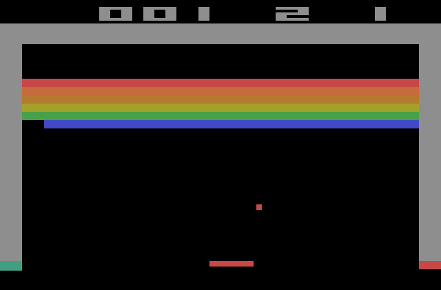

# Breakout 

We are also going to base our 2D game on an already existing 2D Arcade game - Breakout - a classic 2D game released in 1976 on the Atari 2600 console. Breakout requires the player, who controls a small horizontal paddle, to destroy all the bricks by bouncing a small ball against each brick without allowing the ball to reach the bottom edge. Once the player destroys all bricks, he completes the game.

Below we can see how Breakout originally looked on the Atari 2600:

# Mechanics
- A small paddle is controlled by the player and can only move horizontally within the bounds of the screen
- The ball travels across the screen and each collision results in the ball changing its direction based on where it hit; this applies to the screen bounds, the bricks, and the paddles
- If the ball reaches the bottom edge of the screen, the player is either game over or loses a life
- As soon as a brick touches the ball, the brick is destroyed
- The player wins as soon as all bricks are destroyed
- The direction of the ball can be manipulated by how far the ball bounces from the paddle's center.
- Because from time to time the ball may find a small gap reaching the area above the brick wall, it will continue to bounce up and forth between the top edge of the level and the top edge of the brick layer. The ball keeps this up, until it eventually finds a gap again. This is logically where the game obtained its name from, since the ball has to break out.

# OpenGL BREAKOUT
